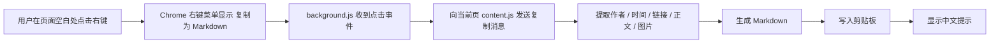

# 设计说明

## 目标

在受支持的 `x.com` 页面中，通过浏览器右键菜单触发“复制为 Markdown”，把当前可见内容整理成适合 AI 对话粘贴的 Markdown。

## v1 范围

- 支持 `https://x.com/<user>/status/<id>`
- 支持 `https://x.com/<user>/article/<id>`
- 支持正文中的普通链接
- 支持正文附件图片链接
- 支持普通 post 中的 quoted post 作为附录输出
- 不支持 thread 合并
- 不支持视频、GIF、投票和评论导出

## 架构概览



## 模块拆分

### 1. 右键菜单入口

- `background.js` 在扩展安装和浏览器启动时创建唯一右键菜单项。
- 菜单只在两种受支持的页面 URL 上显示：
  - `https://x.com/<user>/status/<id>`
  - `https://x.com/<user>/article/<id>`
- 用户点击右键菜单后，由 background 向当前 tab 发送复制消息。

### 2. 内容提取

普通 post：

- 作者：`data-testid="User-Name"`
- 时间：`time[datetime]`
- 链接：时间节点对应的状态链接或第一个 `/status/` 链接
- 正文：`data-testid="tweetText"`
- 引用：同一 `article` 内第二组 `User-Name / time / tweetText`
- 图片：`pbs.twimg.com/media` 附件图

Article 或长文阅读视图：

- 标题：`data-testid="twitter-article-title"`，回退到 `h1`
- 作者：页面顶部作者区中的个人主页链接
- 时间：当前页面对应的 `time[datetime]`
- 正文：`data-testid="twitterArticleReadView"` 下的 `longform-*` 内容块，图片按正文顺序转换成 Markdown 链接
- 图片：长文阅读视图中的 `pbs.twimg.com/media` 图片

## Markdown 模板

普通 post：

```md
作者: {displayName} (@handle)
时间: {datetime}
链接: {url}

正文:
{body}

引用内容:
作者: {quotedDisplayName} (@quotedHandle)
时间: {quotedDatetime}
链接: {quotedUrl}
正文:
> {quotedBody}

图片:
- [图片 1]({imageUrl})
```

X Article：

```md
# {title}

作者: {displayName} (@handle)
时间: {datetime}
链接: {url}

正文:
{body}
```

## 关键取舍

- 主路径只依赖可见 DOM，不把 X 内部状态对象作为主数据源。
- 复制失败时明确提示，不输出不完整 Markdown。
- 入口改为 Chrome 原生右键菜单，避免继续跟 X 页面内菜单结构耦合。

## 已知脆弱点

- `status` 页面详情区的主贴定位依赖当前 URL 和正文 DOM。
- 长文可能同时出现在 `status` 和 `article` 两种 URL 下，且 DOM 与普通 post 完全不同。
- 某些页面如果正文尚未渲染完成，提取会失败。

## 后续可扩展方向

- 支持 thread 合并导出
- 支持输出模板自定义
- 支持 `twitter.com` 和 `mobile.x.com`
